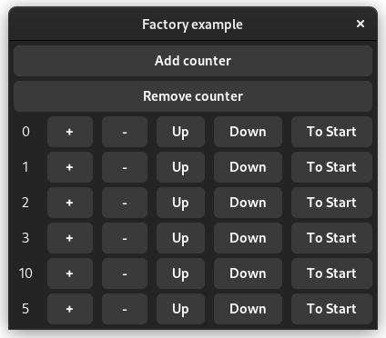

# Factory

Factories define how to generate widgets from collections of data. They are used inside GTK as well, but Relm4 uses them a bit differently.



This app will have a dynamic number of counters which can be changed by pressing the add or remove buttons.
Clicking on a counter will decrement it.

## Factories in Relm4

Let's have a look at factories in Relm4. We want to write a simple application that can create and remove many counters. Each counter needs to store its value and display widgets to allow modifying the counter. In this example we will only decrement the counter.

> The app we will write in this chapter is also available [here](https://github.com/AaronErhardt/relm4/blob/main/relm4-examples/examples/factory.rs). Run `cargo run --example factory` from the [example directory](https://github.com/AaronErhardt/relm4/tree/main/relm4-examples) if you want to see the code in action.

### The model

The most common solution for storing collections of data is a `Vec`. Yet a `Vec` can't help us with efficient UI updates because it does not track changes to itself. If we used a `Vec` we'd have to assume everything could have changed and create all widgets over and over again. So instead we use a `FactoryVec` to store our data. A `FactoryVec` is a simple data structure provided by Relm4 that allows us to push, pop and modify elements. Additionally, it automatically keeps track of all the changes made to itself.

> An overview over all available factory data structures can be found in the documentation [here](https://aaronerhardt.github.io/docs/relm4/relm4/factory/collections/index.html).

```rust,no_run,noplayground
{{#include ../examples/factory.rs:model }}
```

As you can see, we first define the struct `Counter` that just stores the value of a single counter. Then we use a `FactoryVec` to store our counters in the model. For now, all of this is just data. Similar to the model type, we need to define the data structures we need for our UI first. Then we will define how to create widgets from this data. Yet unlike the model type, we can have many counters in a `FactoryVec` and each of them will be represented by its own widgets.

To give our counters an unique value at initialization, we also add a separate counter to the model to count the amount of counters we did already create. 

## The message type

The actions we want to perform are

+ Add new counters
+ Remove counters
+ Decrement a counter

Accordingly, our message type looks like this:

```rust,no_run,noplayground
{{#include ../examples/factory.rs:msg }}
```

You'll notice that an index is passed with `AppMsg::Clicked`. This allows us to select the counter that emitted the clicked signal.

## The update function

The update function takes care of adding, removing and decrementing counters. Each new counter will be initialized with the amount of counters created before it.

```rust,no_run,noplayground
{{#include ../examples/factory.rs:app_update }}
```

> The `get` and `get_mut` methods inside `FactoryVec` return `Some` if the element exists and `None` if the index is invalid. It's recommended to not unwrap this `Option` because messages (and also the indices sent with them) are queued up if your update and view functions are slow and can be stale by the time they are handled.

## The factory implementation

So far the code looked pretty normal. Now to the interesting part of the code.

The first thing we need to implement for a factory is a widgets type. That sounds familiar, right? The widgets used for the factory are actually very similar to the widgets used for your application. They define which widgets represent an element inside a factory data structure like `FactoryVec`.

In our case, we just need a simple button that will decrement the counter when clicked and will also display the counter value.

```rust,no_run,noplayground
{{#include ../examples/factory.rs:factory_widgets }}
```

The `FactoryPrototype` trait we need next is very similar to the `Widgets` trait, too: it defines how widgets are created and updated. Let's have a look at the implementation:

```rust,no_run,noplayground
{{#include ../examples/factory.rs:factory_prototype_start }}
```

Alright, there are quite a few types! Let's look at them one by one:

+ **Factory:** the data structure we use to store our elements. In our case, a `FactoryVec`.
+ **Widgets:** the struct that stores out widgets. That's the `FactoryWidgets` type we just created.
+ **Root:** similar to the root in the `Widgets` trait, it represents the outermost widget. This is usually a container like `gtk::Box` but in our case we just have a `gtk::Button`.
+ **View:** the container we want our widgets to be placed inside. The simplest solution for this is a `gtk::Box`.
+ **Msg:** the messages we want to send to the model containing this factory.

### The generate function

The generate function is similar to `init_view` in the `Widgets` trait: it generates the widgets from data. You'll notice that there's an index as well that we can use to send messages that index the data these widgets represent. The index type might vary between different factory data structures. For the factory type `FactoryVec` an index of the type `usize` is being used.

```rust,no_run,noplayground
{{#include ../examples/factory.rs:generate }}
```

As you can see, we send a message with the index back to the update function to decrement this specific counter when the button is pressed.

### The position function

In our case, the function is pretty short:

```rust,no_run,noplayground
{{#include ../examples/factory.rs:position }}
```

The `gtk::Box` we use here is one-dimensional. This means that a `FactoryVec` can perfectly resemble the layout with its own internal structure because it's one-dimenational as well. In other words, the first element of the `FactoryVec` is also the first in the `gtk::Box`. Yet, some container widgets such as `gtk::Grid` place widgets at fixed two-dimensional positions and rely in the position function to know where a new widget should be added.

Because we don't use it here, the position function is explained in the next chapter.

### The update function

The update function is similar to `view` in the `Widgets` trait: it updates the widgets according to the updated data.

```rust,no_run,noplayground
{{#include ../examples/factory.rs:update }}
```

We just update the label of the button to represent the updated counter value.

### The get_root function

The last function we need is the `get_root` function. It's similar to the `root_widget` in the `Widgets` trait: it returns the root widget, the outermost of our widgets.

```rust,no_run,noplayground
{{#include ../examples/factory.rs:get_root }}
```

## The widgets

The last piece to make our code complete it the definition of the widgets for the application. There's mostly one notable thing: the `factory!` macro.

```rust,no_run,noplayground
{{#include ../examples/factory.rs:widgets }}
```

The `factory!` macro that's almost at the end of the widgets definition now updates our widgets according to the changes we make to the data in our model. It sits inside of the `gtk::Box` we want to use as a container for our counter.

> The `factory!` macro simply expands to `model.data.generate(&self.gen_box, sender)` where `gen_box` is the `gtk::Box` we used as a container. The `generate` function is provided by the `Factory` trait that's implemented for `FactoryVec` and similar data structures.

Now to test this, we could add a print statement to the update function. It will show that decrementing one counter will only update the widgets of one counter. Great, that's exactly what we wanted!

## The complete code

Let's review our code in one piece one more time to see how all these parts work together:

```rust,no_run,noplayground
{{#include ../examples/factory.rs:all }}
```
