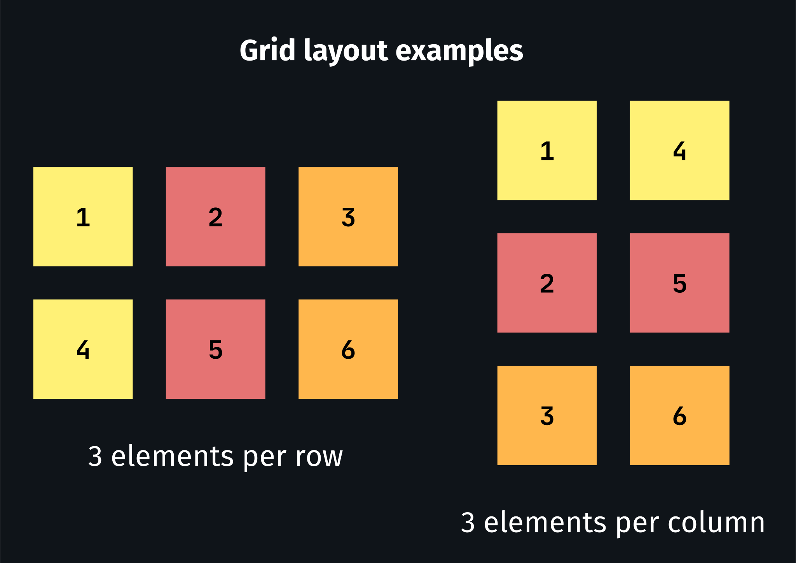
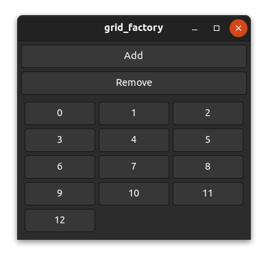
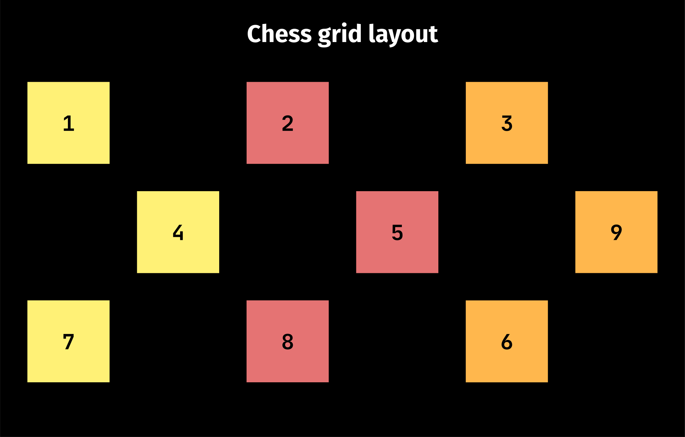
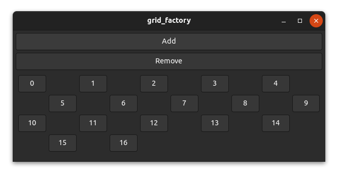

# The position function

Most widgets such as `gtk::Box` don't use the position function because they are one-dimensional and place widgets relative to each other. However, a few widgets such as `gtk::Grid` use fixed positions and need the position function to work inside a factory.

The task of the position function is mainly to map the index to a specific position/area (x, y, width and height) of a factory widget inside the parent widget (view).

> The code we will use in this chapter is based on the grid_factory example [here](https://github.com/AaronErhardt/relm4/blob/main/relm4-examples/examples/grid_factory.rs). Run `cargo run --example grid_factory` from the [example directory](https://github.com/AaronErhardt/relm4/tree/main/relm4-examples) if you want to see the code in action.

## How it works

Let's take a grid as an example. For a grid, there are many possibilities to place your widgets. You can, for example, place three, four or five widgets per row or you could place a certain amount of widgets per column. You can even create patterns like a chess grid if you want to.

However, we want to use a factory for generating our widgets, which means we only have the index to calculate the desired two-dimensional position. In the simplest case, we create a layout that places a certain amount of widgets per row or per column.



To place 3 elements per row from left to right in a `gtk::Grid` we could use the following position function.

```rust,no_run,noplayground
    fn position(&self, index: &usize) -> GridPosition {
        let index = *index as i32;

        let row = index / 3;
        let column = index % 3;

        GridPosition {
            column,
            row,
            width: 1,
            height: 1,
        }
    }
```

And indeed, it works as expected.



## A chess grid

Let's have a look at a more complex layout. It's unlikely that this would be used in a real application, but it's still interesting to have a look at it.

To create a chess grid layout, we need to place our widgets only on fields of one color and leave the other fields empty. Or in other words, we only place widgets on the fields a bishop can reach.



Actually, the code isn't too complicated.

```rust,no_run,noplayground
    fn position(&self, index: &usize) -> GridPosition {
        let index = *index as i32;

        // add a new row for every 5 elements
        let row = index / 5;
        // use every second column and move columns in uneven rows by 1
        let column = (index % 5) * 2 + row % 2;

        GridPosition {
            column,
            row,
            width: 1,
            height: 1,
        }
    }
```

And as you can see, it works!


