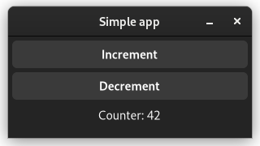
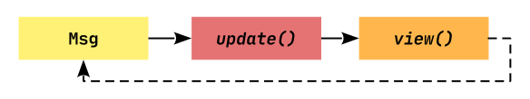

# Your first app

For our first app, let's create something original: a counter app.



In this app, we will have a counter which can be incremented and decremented by pressing the corresponding buttons.

> The app we will write in this chapter is also available [here](https://github.com/AaronErhardt/relm4/blob/main/relm4-examples/examples/simple_manual.rs). Run `cargo run --example simple_manual` from the [example directory](https://github.com/AaronErhardt/relm4/tree/main/relm4-examples) if you want to see the code in action.

## Application architecture

Often, programming concepts are easier to understand when explained with examples or metaphors from the real world. To understand how Relm4 apps work, you can think about a computer as a person.

Our job as a programmer is to ensure that the users of our app will be able to communicate with the computer through the UI. Since the computer can't understand our human language, it needs some help from us to get the communication going. 

Let's have a look at what we need to get this done!

### Messages

To help the computer understand what we want to tell it, we first translate user interactions into messages.

In Relm4, a message can be any data type, but most often, an `enum` is used. In our case, we just want to tell the computer to either increment or decrement a counter.

```rust,no_run,noplayground
{{#include ../examples/simple_manual.rs:msg }}
```

### The model

Like a person, a computer needs a brain to be functional. It needs to process our messages and remember the results.

Relm4 uses the term `Model` as a data type that represents the application state, the memory of your application. For our counter app, the computer only needs to remember the counter value, so an `u8` is all we need.

```rust,no_run,noplayground
{{#include ../examples/simple_manual.rs:model }}
```

### The `AppUpdate` trait

Of course, the brain needs to do more than just remembering things, it also needs to process information.

Here, both the model and message types come into play. The `update` function of the `AppUpdate` trait tells the computer how to process messages and how to update its memory.

```rust,no_run,noplayground
{{#include ../examples/simple_manual.rs:app_update }}
```

> `wrapping_add(1)` and `wrapping_sub(1)` are like `+1`  and `-1`, but don't panic on overflows.

Also, we return `true` to tell the computer to keep our application alive. If our app should close, we can simply return `false`.


### The widgets

The computer is now able to process and remember information, but we still need an interface to for communication with the user.

GTK4 offers the computer widgets that allow it to take input and to respond. Widgets are simply parts of an UI like buttons, input fields or text areas. To be able to update the widgets in our program, we can put them all into a `struct`.

For our app, we use a window with two buttons to increment and decrement the counter and a label to display the counter value. Besides that, we need a box as a container to place our buttons and the label inside because a window can only have one child.

```rust,no_run,noplayground
{{#include ../examples/simple_manual.rs:widgets }}
```

### The `Widgets` trait

The last step we need it to tell the computer how to initialize widgets and how to update them.

In Relm4, the UI represents the memory of the application. All that's left to do is to implement the `Widgets` trait that tells the computer exactly how its memory should be visualized.

Let's do this step by step. First, we'll have a look at the beginning of the trait `impl`.

```rust,no_run,noplayground
{{#include ../examples/simple_manual.rs:widgets_trait_start }}
```

The two generic parameters are our model and the parent model. We're at the root of our app so don't have parent model and can use `()` as placeholder.

The `Root` type is the outermost widget of the app. Components can choose this type freely, but the main application must use an `ApplicationWindow`.

Next up, we want to initialize our UI.

> Don't worry about the amount of manual code you need for handling widgets. In the next chapter, we'll see how this can be done easier.

```rust,no_run,noplayground
{{#include ../examples/simple_manual.rs:init_view }}
```

First, we initialize each of our widgets, mostly by using builder patterns.

Then we connect the widgets so that GTK4 knows how they are related to each other. The buttons and the label are added as children of the box, and the box is added as the child of the window.

Next, we connect the "clicked" event for both buttons and send a message from the closures to the computer. To do this, we only need to move a cloned sender into the closures and send the message. Now every time we click our buttons, a message will be sent to update our counter!

Still our UI will not update when the counter is changed. To do this, we need to implement the view function that modifies the UI according to the changes in the model.

```rust,no_run,noplayground
{{#include ../examples/simple_manual.rs:view }}
```

We're almost done. To complete the `Widgets` trait, we just need to implement the `root_widget` method that simply returns the `Root`.

```rust,no_run,noplayground
{{#include ../examples/simple_manual.rs:root_widget }}
```


### The `Model` trait

In the `Model` trait, everything comes together. This trait just describes how the types we defined work together.

```rust,no_run,noplayground
{{#include ../examples/simple_manual.rs:model_trait }}
```


## Running the App

The last step is to run the app we just wrote. To do so, we just need to initialize our model and pass it into `RelmApp::new()`.

```rust,no_run,noplayground
{{#include ../examples/simple_manual.rs:main }}
```

🎉 Congratulations! You just wrote your first app with Relm4! 🎉

## Summary

Let's summarize what we learned in this chapter.

A Relm4 application has three important types:

1. The model type that stores the application state, the memory of our app.
2. The message type that describes which information can be sent to update the model.
3. The widgets type that stores our widgets.

Also, there are two important functions:

1. `update` receives a message and updates the model accordingly.
2. `view` receives the updated model and updates the widgets accordingly.

The app does all those things in a loop. It waits for messages and once a message is received, it runs `update` and then `view`.



> Relm4 separates the data and the UI. The UI never knows which message was sent, but can only read the model. This might seem like a limitation, but it helps you to create maintainable, stable and consistent applications.

## Conclusion

I hope this chapter made everything clear for you :)

If you found a mistake or there was something unclear, please open an issue [here](https://github.com/AaronErhardt/relm4/issues).

As you have seen, initializing the UI was by far the largest part of our app, with roughly one half of the total code. In the next chapter, we will have a look at the `relm4-macros` crate that offers a macro that helps us to reduce the amount of code we need to implement the Widgets trait.

> As you might have noticed, storing `inc_button`, `dec_button` and `vbox` in our widgets `struct` is not necessary because GTK will keep them alive automatically. Therefore, we can remove them from `AppWidgets` to avoid compiler warnings.

## The complete code

Let's review our code in one piece to see how all these parts work together:

```rust,no_run,noplayground
{{#include ../examples/simple_manual.rs:all }}
```
