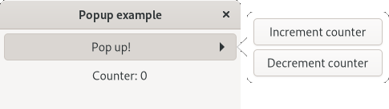
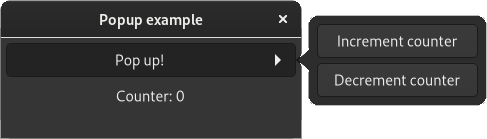

<h1>
  
</h1>

[](https://matrix.to/#/#relm4:matrix.org)
[](https://crates.io/crates/relm4)
[](https://aaronerhardt.github.io/docs/relm4/relm4/)

Relm4 is an idiomatic GUI library inspired by [Elm](https://elm-lang.org/) and based on [gtk4-rs](https://crates.io/crates/gtk4). 
It is a new version of [relm](https://github.com/antoyo/relm) that's built from scratch and is compatible with [GTK4](https://www.gtk.org/) and [libadwaita](https://gitlab.gnome.org/GNOME/libadwaita).

## Why Relm4

We believe that GUI development should be easy, productive and delightful.  
The [gtk4-rs](https://crates.io/crates/gtk4) crate already provides everything you need to write modern, beautiful and cross-platform applications.
Built on top of this foundation, Relm4 makes developing more idiomatic, simpler and faster and enables you to become productive in just a few hours.

## Requirements

To work with Relm4, you should understand most basic language features of the Rust programming language. We recommend to at least be familiar with the content of the chapters 1, 3-6, 8, 10 and 13 of the [Rust book](https://doc.rust-lang.org/stable/book/title-page.html).

I also recommend reading the [gtk4-rs book](https://gtk-rs.org/gtk4-rs/git/book/) for getting more insight into development with gtk4-rs. Yet, knowledge of GTK4 or gtk4-rs is not required in this book.

**Helpful links:**

+ [How to install GTK4 for Rust](https://gtk-rs.org/gtk4-rs/git/book/installation.html)
+ [gtk4-rs book](https://gtk-rs.org/gtk4-rs/git/book/)
+ [gtk4-rs docs](https://gtk-rs.org/gtk4-rs/git/docs/gtk4/index.html)

**Cargo:**

Add the packages you need to your `Cargo.toml`:

```toml
gtk = { version = "0.3", package = "gtk4" }
relm4 = "0.2"
relm4-macros = "0.2"
relm4-components = "0.2"
```

## Issues and feedback

If you find a mistake or something unclear in Relm4 or this book, let me know! Simply open up an issue over at [GitHub](https://github.com/AaronErhardt/relm4/issues) or chat with us on [Matrix](https://matrix.to/#/#relm4:matrix.org).

## Platform support

All platforms supported by GTK4 are available for Relm4 as well:

+ Linux
+ Windows
+ MacOS

## Examples

If you prefer learning directly from examples, we got you covered!

Many code examples in this book and many other examples can also be found in the [relm4-examples crate](https://github.com/AaronErhardt/relm4/tree/main/relm4-examples). Whenever an example is discussed in the book, the introduction will mention the name of the example and provide a link to it.

To setup the examples run

```bash
git clone https://github.com/AaronErhardt/relm4.git
cd relm4
cd relm4-examples
```

And to run an example, simply type

```
cargo run --example NAME
```

### Screenshots

As a sneak peak here are screenshots of some examples.

|Light Theme | Dark Theme |
|:----:|:----:|
| |  |
| | |


# Special thanks

I want to thank all contributors of [relm](https://github.com/antoyo/relm) especially [antoyo](https://github.com/antoyo) for building relm that inspired much of the work on Relm4.

Also, I want to thank all contributors of [gtk-rs](https://gtk-rs.org/) that put a lot of effort into the project for creating outstanding Rust bindings for GTK4.

I want to thank [tronta](https://github.com/tronta) for contributing a lot of improvements to this book.
