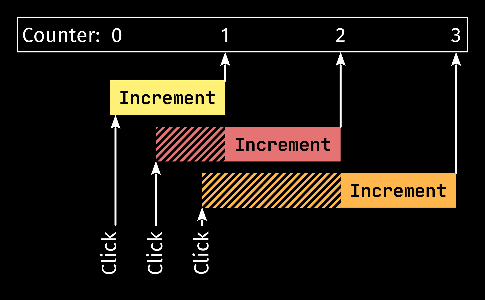
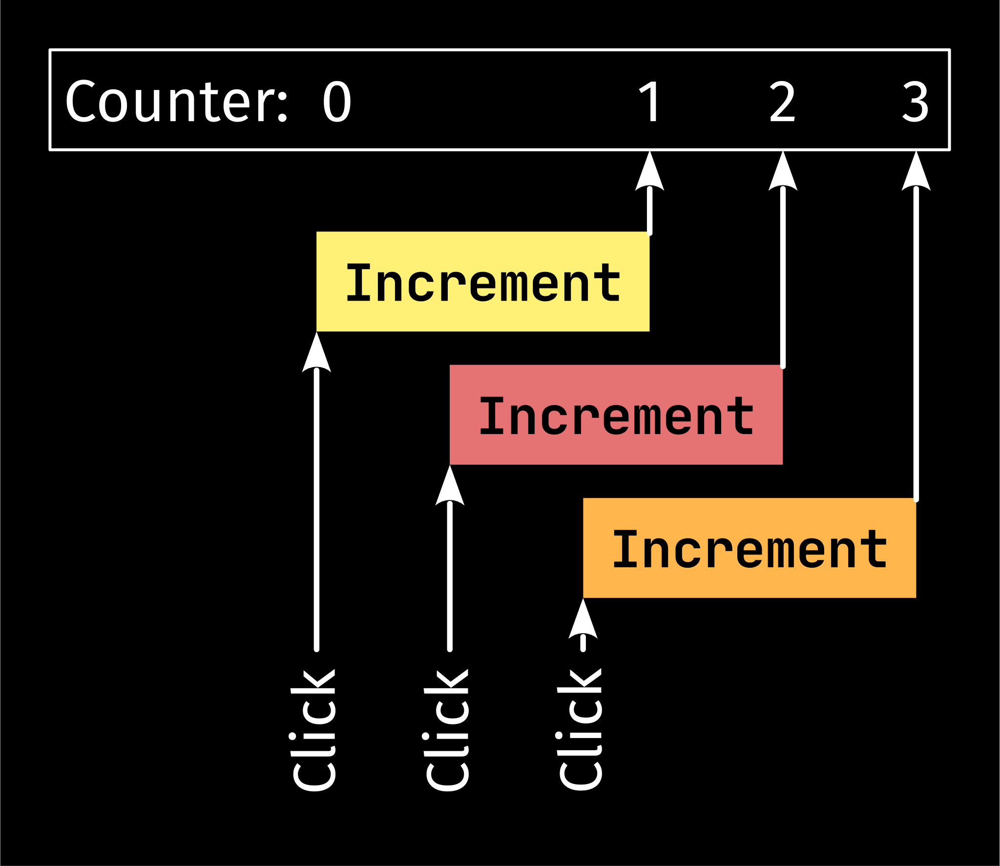

# Message handlers

We've already seen that workers are basically components without widgets. In this chapter, we will talk about message handlers that are even simpler: like workers but without a model.
## The motivation

You might wonder why we even need message handlers. Components and workers are already some kind of message handlers, right? That's true, but components and workers do more than just handling messages: they also have a model that represents their state.

The problem with the state is that Rust doesn't like sharing mutable data. Only one mutable reference can exist at the time to prevent race conditions and other bugs. However, both components and workers can update their state in the update function while handling messages. This means that components and workers can only handle one message at the time. Otherwise, there would be multiple mutable references to the model.

Handling one message at the time is perfectly fine in most cases. However, if you, for example, want to handle a lot of HTTP requests and you send one message to a worker for each request you want to handle, that'd mean that one message is sent after another. This could cause a huge delay. Fortunately, message handlers can solve this issue.

## Implementing a message handler

To keep it simple, we will create another counter app. Yet this time, every click will be delayed by one second. If a user clicks the increment button, the counter will be incremented exactly one second later.


> The app we will write in this chapter is also available [here](https://github.com/AaronErhardt/relm4/blob/main/relm4-examples/examples/non_blocking_async.rs). Run `cargo run --example non_blocking_async` from the [example directory](https://github.com/AaronErhardt/relm4/tree/main/relm4-examples) if you want to see the code in action.

### The timing

Let's have a look at a simple timing diagram that shows what would happen if we used a worker for our app.



All three clicks happen in one second. But because we can only handle one message at a time in a worker, we have to wait one second, only for processing the first message. The second and the third message are then handled too late because our worker was **blocking** while handling the first message (see the striped parts in the diagram).

But how would our ideal timing diagram look like?



In the second diagram, there's no blocking. The second and the third message are handled instantly, so they can increment the counter exactly one second after the user clicked the button for the second and third time.

Alright, let's implement it!

### The includes

In this example, the includes are a little special because we have two kinds of senders. We've already seen `relm4::Sender` (aka `glib::Sender`) several times as it's used by Relm4 to send messages to components and workers. The other one is `tokio::sync::mpsc::Sender`, the sender we use for the message handler. We could use any sender type we want for the message handler because we're implementing all of the message handling ourselves. Yet, because we want a sender that supports async Rust, the sender from [tokio](https://docs.rs/tokio/1.11.0/tokio/sync/mpsc/struct.Sender.html) is a reasonable choice.

Since both senders are called `Sender` by default we rename the latter to `TokioSender` in the last line of the includes.

```rust,no_run,noplayground
{{#include ../examples/message_handler.rs:include }}
```

> Relm4 runs updates for workers and components on the [glib main event loop](https://gtk-rs.org/gtk4-rs/git/book/main_event_loop.html) that's provided by GTK. Therefore, Relm4 uses `relm4::Sender` aka [`glib::Sender`](https://gtk-rs.org/gtk-rs-core/stable/latest/docs/glib/struct.Sender.html) to send messages to workers and components.

### The model

The model and the message type are the same as in our first app.

```rust,no_run,noplayground
{{#include ../examples/message_handler.rs:model }}
```

The update function is identical, too.

```rust,no_run,noplayground
{{#include ../examples/message_handler.rs:app_update }}
```

### The message handler

Our message handler needs to store our sender and also the tokio runtime we use to process our messages (to keep the runtime alive).

And of course, we need a message type as well.

```rust,no_run,noplayground
{{#include ../examples/message_handler.rs:handler }}
```

Then we need to implement the `MessageHandler` trait for our message handler.

```rust,no_run,noplayground
{{#include ../examples/message_handler.rs:handler_impl }}
```

First we define the message type. Then we specify the sender type. You could, for example, use `std::sync::mpsc::Sender`, `tokio::sync::mpsc::Sender` or any other sender type you want.

The `init` function simply initializes the message handler. In the first part, we create a new tokio runtime that will process our messages. Then we check for messages in a loop.

```rust,no_run,noplayground
{{#include ../examples/message_handler.rs:async_loop }}
```

When using components and workers, this loop runs in the background. Here we need to define it ourselves. The important part here is the `await`. Because we wait for new messages here, the tokio runtime can process our messages in the meantime. Therefore, we can handle a lot of messages at the same time.

> If you want to learn more about async in Rust, you can find more information [here](https://rust-lang.github.io/async-book/).

Inside the loop, we process the message by waiting one second and then sending a message back to the parent component.

The `send` method defines a convenient interface for sending messages to this message handler and the `sender` method provides a sender to connect events later.

### The components

Next, we need to add the message handler to our components. It's very similar to adding workers.

```rust,no_run,noplayground
{{#include ../examples/message_handler.rs:components }}
```

### The widgets

The last part we need is the widgets type. It should look familiar except for the events.

```rust,no_run,noplayground
{{#include ../examples/message_handler.rs:widgets }}
```

We're connecting the event directly to the message handler. You could pass the message through the update function of your app and forward it to the message handler, but the macro provides a special syntax to connect events directly.

```rust,no_run,noplayground
{{#include ../examples/message_handler.rs:connect }}
```

You'll notice that we use brackets instead of parentheses here. That tells the macro that we want to connect an event with a sender from a component. The syntax looks like this.

```rust,no_run,noplayground
connect_name[sender_name = components.component_name.sender()] => move |_| { ... }
```

### Conclusion

That's it! We've implemented our first message handler.

## The complete code

Let's review our code in one piece one more time to see how all these parts work together:

```rust,no_run,noplayground
{{#include ../examples/message_handler.rs:all }}
```
