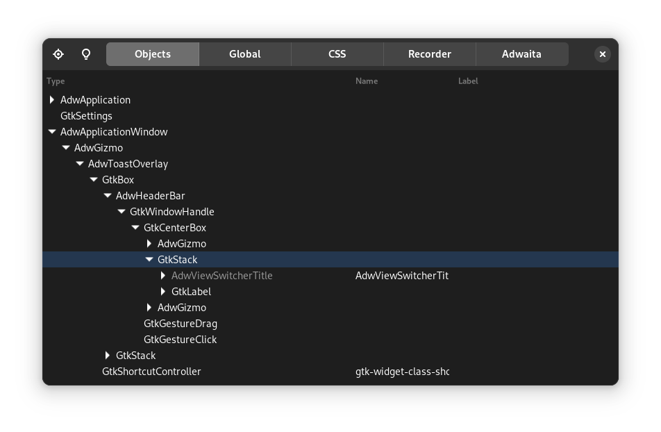
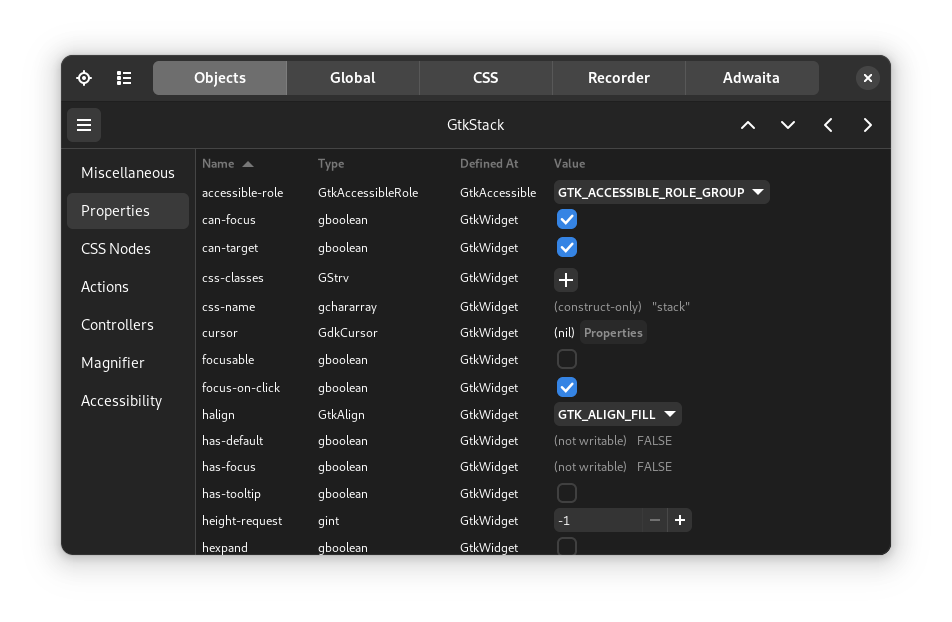

# Tips and tricks

This chapter comes quite early in the book because it is quite helpful for beginners, but is certainly also useful for more advanced users.
It  contains the most common tips and tricks you will need while using Relm4.
In case you have a problem, you can simply return to this chapter and might find something helpful very quickly.
We recommend to have at least a short look at this chapter, but there's no crucial information in here so you can already continue with the next chapter if you want.

## Advanced view macro features

Some features of the view macro are explained very late in the book and are easy to overlook.
Here's a short summery of those features, which you might find useful.
If you found something interesting, you can look for more details in the [macro reference chapter](./component_macro/reference.html).

+ Initialization using a builder pattern
+ Pass additional arguments
+ Pass `Some(widget)`
+ `if` and `match` statements to dynamically select visible widgets
+ Use the return value of assignments
+ Optional and iterative assignments

## Common pitfalls

The Elm architecture itself is pretty simple, but as your application grows, small oversights can sometimes cause large problems.

### Message recursion

Relm4 components use a simple update loop: Receive a message, update the model and then update the view.
Usually, this works as intended, but if updating the view somehow creates a new, identical message, your code will be stuck in an infinite loop and your app will freeze.
To prevent this, the view macro has the `block_signal` attribute which is explained [here](/component_macro/reference.html#blocking-signals-temporarily).

### Sending errors

Sending messages in Relm4 can lead to panics under certain circumstances.
The most common mistake is dropping a `Controller`.
This will cause the entire runtime of the component to be dropped together with all it's receivers.
Sending message to this component afterwards will not work because the receiving side is not available anymore.
To avoid this problem, you can either store the `Controller` in the model of its parent components or call [`detach_runtime()`](https://docs.rs/relm4/latest/relm4/component/struct.Controller.html#method.detach_runtime).

Also note that sending output messages will not work if you [`detach`](https://docs.rs/relm4/latest/relm4/component/struct.Connector.html#method.detach) a component, again because this means that no receiver is available.
In this case it might be desired to ignore sending errors.

## Common compiler errors

Relm4's macros try to make your life easier, but sometimes the created error messages are rather confusing.
This is not something that can be fully fixed in the macro itself due to the limitations of the Rust programming language, but we try to summarize some common errors in this section.

### Private type in public interface

The `#[component]` and `#[factory]` macros will automatically generate a struct for storing your widgets.
This struct must have the same visibility as the model because it is associated with the `Component` or `FactoryComponent` implementation of the model.
To tell the macro to generate a public widgets type, you can simply use `#[component(pub)]` or `#[factory(pub)]`.

### Method `container_add` is missing

Relm4 implements the [`ContainerExt`](https://docs.rs/relm4/latest/relm4/trait.RelmContainerExt.html#tymethod.container_add) trait for many widgets that allows you simply nest widgets in the view macro.

```rust,ignore
gtk::Box {
    gtk::Label {
        // ...
    }
}
```

Unfortunately, this trait can't always be implemented because some widgets don't have a obvious method for adding children.
For `gtk::Box` it is relatively simple and just uses the `append()` method internally.
However, `gtk::Header` has three possible locations to add children: start, center and end.
Implementing `RelmContainerExt` for such a type is not possible because it's not clear what the default behavior should be.
Other types such as `gtk::Grid` even need more information to place children.
In this case, you can simply pass the method name before declaring the child widget.
Also, we often need a reference (`&`) because most methods in gtk-rs take references.

```rust,ignore
gtk::HeaderBar {
    pack_start: &gtk::Label {
        // ...
    }
},
gtk::Grid {
    attach[0, 0, 1, 1]: &gtk::Label {
        // ...
    }
}
```

## Working with gtk-rs

The structure and design of most gtk-rs crates is often a bit different from most other Rust crates.
Because GTK is based on GObject, a C library that implements object-oriented programming, the gtk-rs developers had to come up with some clever ideas to integrate the C code into Rust.

### Reading docs

Looking at the documentation of [`gtk::Box`](https://gtk-rs.org/gtk4-rs/git/docs/gtk4/struct.Box.html) makes it look like this type has just a `new()` and a `builder()` method.
However, this is not quite true as the `gtk::Box` type comes with plenty of methods.
To find those methods, you have to look at ["implements" section](https://gtk-rs.org/gtk4-rs/git/docs/gtk4/struct.Box.html#implements), which contains a list of traits implemented by this type.
In particular, [`BoxExt`](https://gtk-rs.org/gtk4-rs/git/docs/gtk4/prelude/trait.BoxExt.html) gives you a lot of useful methods.
Another very important trait in the list is [`WidgetExt`](https://gtk-rs.org/gtk4-rs/git/docs/gtk4/prelude/trait.WidgetExt.html) which is implemented by all widgets.
In the same fashion, you can find the available methods of other widgets.

### Using the inspector

GTK has a built-in inspector that has similar features as browser developer tools.
You can use them to look at individual widgets, modify their properties, apply custom CSS and much more.
In particular, it is very useful for finding the best values before integrating them into your code.

To use the inspector, you only need to press `Ctrl+Shift+D` while you have a GTK application opened (this not just works for Relm4, but all GTK based apps).
You should see an overview over all your widgets, which you can expand row by row.
Yet, to select widgets, it is more convenient to the the button in the top left which allows you to select a widget by clicking on your app.
Once you have selected a widget, you can modify its properties.

You can also use the CSS tab to apply custom CSS to your application.
Once you entered your rules, make sure the pause button is not selected.
For example, you could try setting a border for every widget:

```css
* {
    border: 1px solid red;
}
```

| Widget overview | Widget properties |
| --- | --- |
|  |  |

### Demo applications

Both GTK4, libadwaita and ASHPD (a library for portals) have demo applications.
Those are very useful when searching for widgets and other features, especially when combined with the inspector.

+ Setup gnome-nightly flatpak remote: `flatpak remote-add --if-not-exists gnome-nightly https://nightly.gnome.org/gnome-nightly.flatpakrepo`
+ Install the GTK4 demo: `flatpak install gnome-nightly org.gtk.Demo4`
+ Install the Adwaita demo: `flatpak install gnome-nightly org.gnome.Adwaita1.Demo`
+ Install the ASHPD demo: `flatpak install flathub com.belmoussaoui.ashpd.demo`

## Our ecosystem

Relm4 also offers a few extra crates and projects to make your life easier:

+ [relm4-template](https://github.com/Relm4/relm4-template): A template for flatpak apps that saves a lot of time for setting up new projects
+ [relm4-icons](https://github.com/Relm4/icons): Over 2000 icons, ready to use for your app
+ [relm4-components](https://docs.rs/relm4-components/latest/relm4_components/): A collection of handy components

## Guaranteed helpful: Our matrix chat

In case you didn't find the answer to your question in this book, feel free to ask it in our matrix chat or in a GitHub discussion (you can find all links in our [README](https://github.com/Relm4/Relm4#readme)).
We are always happy to help you!
After all, this chapter was assembled from the most common questions we got from either GitHub or the matrix chat.